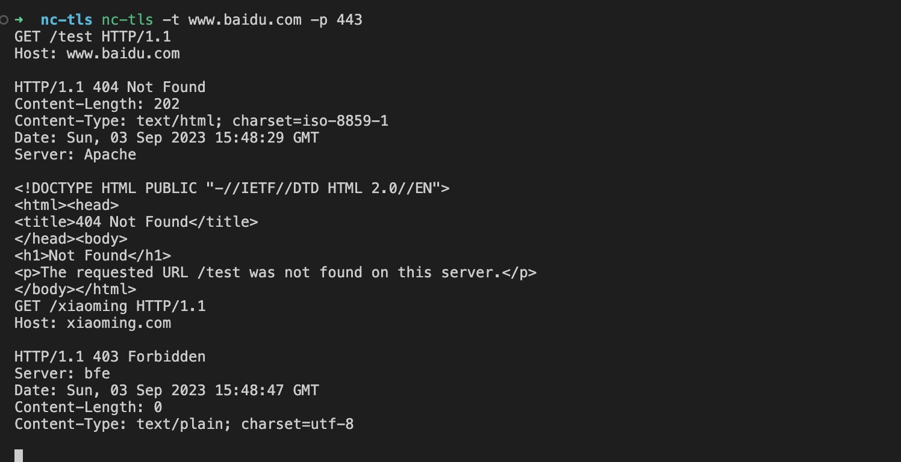

vim流挖洞选手使用go编写的一个TLS 连接版 NC 

## 安装方法:
```
go install "github.com/ShangRui-hash/nc-tls"
```

## 使用方法

```
nc-tls -t www.baidu.com -p 443 
```

此时将会建立本机到www.baidu.com 443 端口的TLS连接， 并且TLS连接输出对接到标准输出，标准输入对接到TLS的连接的输入，也就是说，现在你可以直接通过TLS连接来发送https请求报文了, 并且你向标准输入中输入多少字符，就发送多少字符。



该TLS连接会长时间保持，除非服务器端主动关闭连接，例如：http响应码返回400时，连接可能会被服务器端主动关闭

好玩的地方在于，你可以使用同一个TLS连接，连续发送多条HTTP request

```sh 
cat ./demo/request.http | tls-nc -t www.baidu.com -p 443
```
request.http 的内容为:
```
GET /?id=1 HTTP/1.1
Host: www.baidu.com 

GET /?id=2 HTTP/1.1
Host: www.baidu.com 

GET /?id=3 HTTP/1.1
Host: www.baidu.com 

GET /?id=4 HTTP/1.1
Host: www.baidu.com 

GET /?id=5 HTTP/1.1
Host: www.baidu.com 

```

